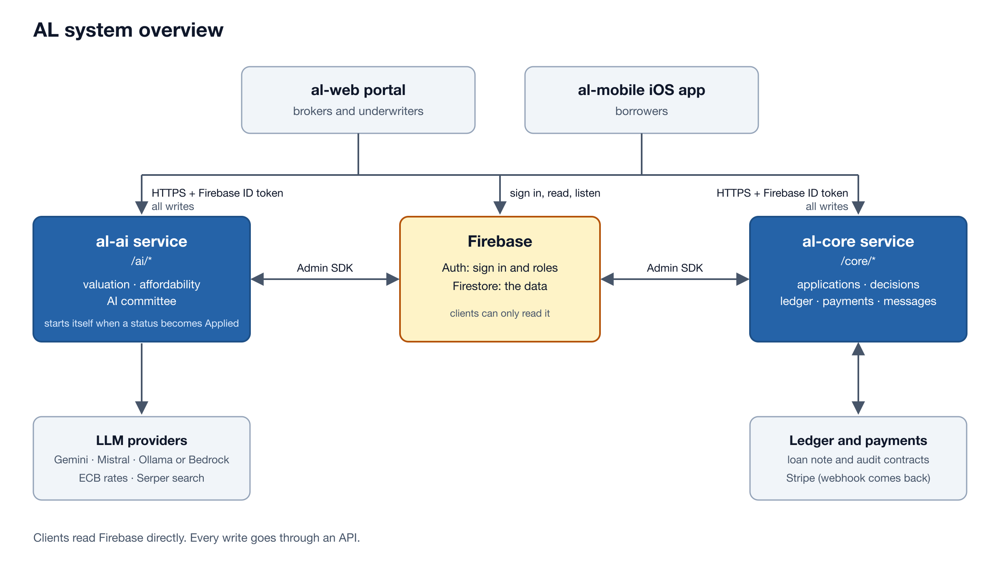
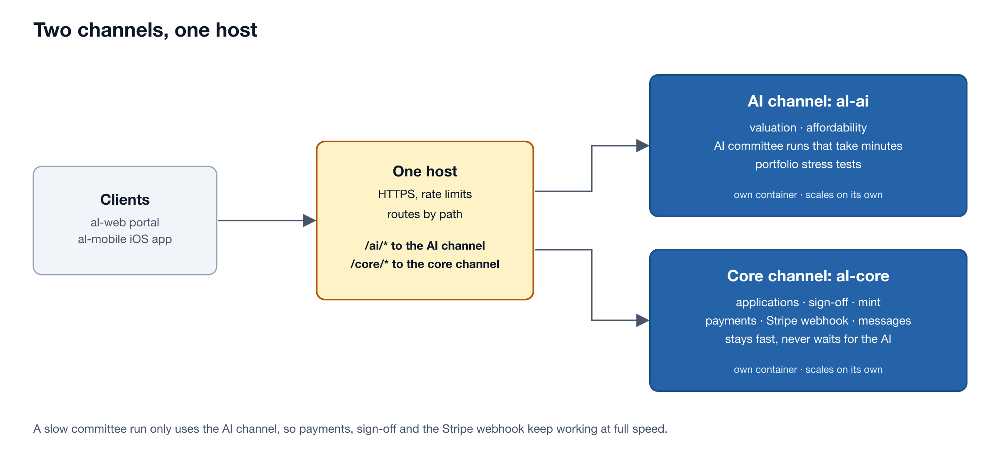
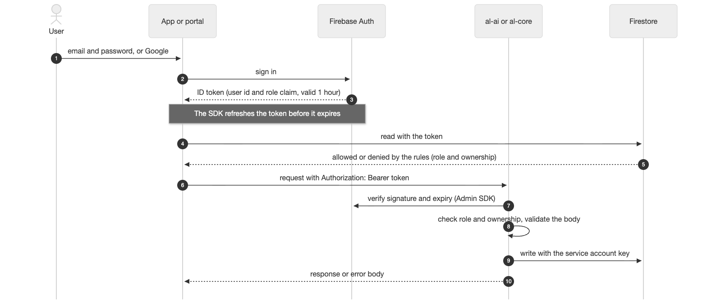
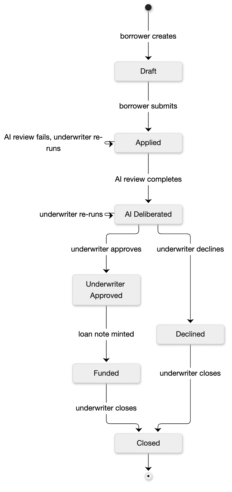
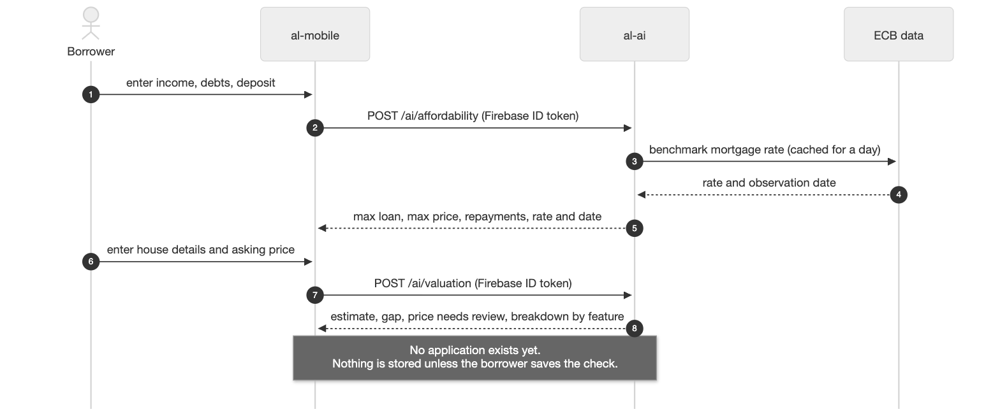
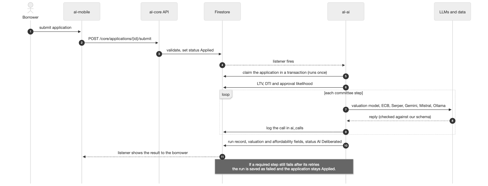
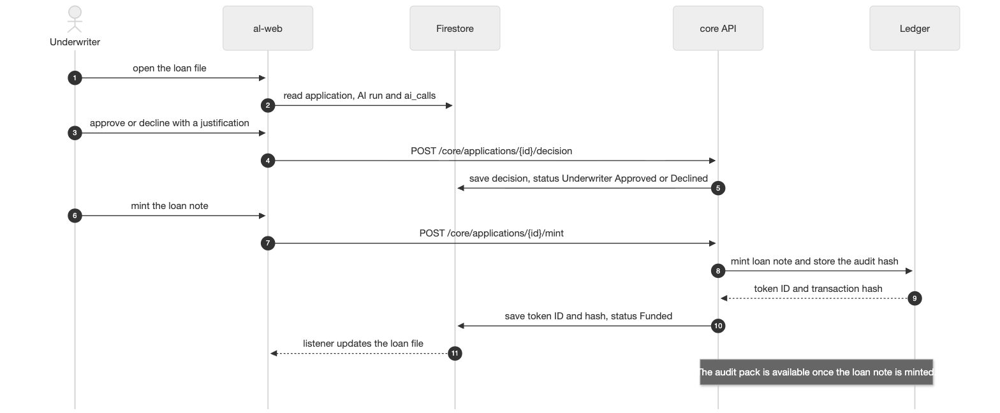

# AL API Design

| | |
|---|---|
| Scope | How the AL APIs are built: the two services, authentication, security, rate limiting, endpoints and responses |
| Version | 1.0 |
| Date | October 2026 |
| Owners | al-ai: Nic. al-core: Nic and Dumi |

## 1. Overview

AL (Agentic Lender) processes mortgage and HELOC applications. Borrowers use the iOS app; brokers and bank underwriters use the web portal. Both connect to one backend.

The backend is **two Python FastAPI services** behind one host. al-ai runs valuation, affordability and the AI committee. al-core manages applications, decisions, the ledger, payments and messages. Firebase (Firestore and Auth) stores the data.

- Clients **read Firestore directly** and listen for changes.
- Every **write goes through an API**.
- Each API call includes a **Firebase ID token**. Its `role` claim sets the caller's permissions.
- Submitting an application **starts the AI review by itself**.



*Figure 1. System overview.*

## 2. Two-service design

| | al-ai | al-core |
|---|---|---|
| Path | `/ai/*` | `/core/*` |
| Owner | Nic | Nic and Dumi |
| Does | Values property, checks affordability, runs the AI committee and portfolio stress tests | Manages users, applications, decisions, the ledger, payments and messages |
| Heavy work | Saved ML model and LLM calls, which can take minutes | Calls to contracts and Stripe |
| Calls out to | ECB, Serper, Gemini, Mistral, Groq, Ollama (local) or Bedrock (AWS) | Stripe and the smart contracts |

Both services use the Admin SDK to read and write Firestore.

**Why two services.** An AI committee run may take minutes. If it shared a service with payments and sign-off, a busy queue could hold up a Stripe webhook or an underwriter. Separate services keep AI work apart from the core API. Each can scale and deploy on its own.

**How traffic is split.** Clients use one host. The load balancer sends `/ai/*` requests to al-ai and `/core/*` requests to al-core. Each service runs in a separate container. The deployment doc explains the AWS setup.



*Figure 2. Two channels, one host.*

## 3. Reads, writes and data

**Reads** go directly to Firestore. The client sends the user's ID token, then Firestore rules limit which documents the user can see. Live listeners update the screen when data changes, so clients do not poll.

**Writes** pass through an API. Firestore rules prevent clients from writing. The service checks the token, role, ownership, fields and current status before it writes through the Admin SDK. Clients cannot bypass a step or set their own `status`.

**The AI review is asynchronous.** The borrower calls `POST /core/applications/{id}/submit` and receives a response while the review runs. al-ai watches Firestore for `status` `Applied`, claims the application in a transaction and runs the committee once. The app tracks progress through live listeners on `status` and `aiRunStatus`. The request does not wait for the review.

| Collection | Who reads it | What it holds |
|---|---|---|
| `users/{uid}` | That user, underwriters | Profile and chosen broker |
| `applications/{id}` | The borrower, the assigned broker, underwriters | Status, `aiRunStatus`, loan type, loan terms, LTV, DTI, approval likelihood, decision, loan note |
| `applications/{id}/review/underwriting` | The assigned broker, underwriters | Risk tier (A to D), DTI breakdown, valuation detail |
| `applications/{id}/audit/record` | The assigned broker, underwriters | The audit record behind the audit hash, written at mint |
| `ai_runs`, `ai_calls` | The assigned broker, underwriters | One record per committee run and per AI call |
| `applications/{id}/messages` | The borrower, the assigned broker, underwriters | The message thread |

Firestore grants access one document at a time. Underwriter-only details therefore live in a separate `review/underwriting` document, hidden from borrowers.

**Audit hash.** At mint, al-ai builds one JSON audit record: the application id, the decision, the risk tier, the credit memo, the underwriter's id, the sign-off time, and every `ai_calls` id for the run with the SHA-256 of that call's document. The record is turned into text with sorted keys and no spaces (`json.dumps(record, sort_keys=True, separators=(",", ":"))`), and the SHA-256 of that text is the audit hash. Both services use one shared function for this, so they always get the same hash. al-core stores the full record at `audit/record` and the hash on-chain, once per application. To check a loan, hash the stored record again and compare it with the on-chain value. Declined applications have no audit record.

## 4. Authentication

1. The user signs in to Firebase Auth with email and password or with Google.
2. Firebase issues an **ID token** that expires after 1 hour. The SDK refreshes it. It contains the user id and a `role` claim (`borrower`, `broker` or `underwriter`).
3. Every API request from the client includes `Authorization: Bearer <token>`.
4. The service uses the Admin SDK to check the token's signature, expiry and revocation. It reads the role and confirms the caller owns the resource or has permission to act on it.

`POST /core/me` sets the role at sign-up. The service never accepts it from a request body.



*Figure 3. Sign in and token.*

| Role | Can do |
|---|---|
| Borrower | Work only on their own applications: edit a draft, submit, pay the fee, message, save checks |
| Broker | Read and message on applications where they are the assigned broker |
| Underwriter | See every application, re-run the AI review, approve or decline, mint the loan note, run the stress tests |

Two calls skip Firebase tokens. Stripe's signature verifies the webhook; the load balancer can access the open health checks.

## 5. Security

| Control | What it does |
|---|---|
| HTTPS only | Tokens and personal data travel encrypted. Plain HTTP is limited to localhost. |
| Read-only Firestore rules | Even a modified client cannot write a status, decision or loan note directly to the database. |
| Role and ownership checks | Each endpoint checks the caller's role and ownership. Borrowers cannot access another borrower's application. |
| Input validation | Typed models validate each request body. An invalid value returns `422` and names the field. |
| Service account key | The key stays on the servers. App Firebase config is public and does not grant access by itself. |
| Secrets | Local secrets go in `.env`; deployed secrets go in AWS Secrets Manager. They never enter the repo or logs. Every commit is scanned. |
| CORS | Only the portal's origin can call the APIs. Tokens use a header, so the APIs do not use cookies. |
| Stripe webhook | Stripe's signature is checked against the raw body. The fee is paid only when the payment succeeded and its intent id matches the stored id, amount EUR 150 and currency `eur`. |
| No personal data on chain | The ledger stores the terms, a public id and a hash. It stores no identifying details. |
| Safe errors | Errors expose no stack trace, key or another user's data. The request id links to details in the logs. |

## 6. Rate limiting

Rate limits cap traffic and spending. Requests to an AI service can start paid LLM calls, so abuse can raise costs and slow the service.

- A web application firewall (WAF) protects both services before traffic reaches the load balancer.
- The limit is **300 requests per 5 minutes per IP address**. For `POST /core/me`, it is **20 requests per minute per IP address** to curb sign-up abuse.
- AWS managed WAF rules block common attacks.
- A blocked request returns `429` or `403` with a `Retry-After` header. WAF may return plain text, so clients treat non-JSON errors as general failures and wait for `Retry-After` before retrying.
- Only an underwriter can rerun the committee. If a run is already `running`, another request returns `409`. The system starts the first review without a client call.

## 7. Endpoints

All endpoints below use the same host. The generated request and response models at `/ai/docs` and `/core/docs` define each field.

**al-ai** (`/ai/*`)

| Endpoint | Who | What it does |
|---|---|---|
| `GET /ai/valuation/options` | Any signed-in role | List supported counties, property types and BER values |
| `POST /ai/valuation` | Any signed-in role | Estimate a house value, compare an optional asking price and show each feature's effect |
| `POST /ai/affordability` | Any signed-in role | Calculate the maximum loan and price plus repayments from income, debts and deposit |
| `POST /ai/committee/runs` | Underwriter | Start another AI review |
| `POST /ai/portfolio/rate-shock` | Underwriter | Measure an interest rate shock across the active portfolio |
| `POST /ai/portfolio/downturn` | Underwriter | Measure a house price drop across the active portfolio |
| `GET /ai/health` | Open | Report whether the service is running |

**al-core** (`/core/*`)

| Endpoint | Who | What it does |
|---|---|---|
| `POST /core/me` | New user | Create a profile and assign its role |
| `GET /core/me`, `PUT /core/me/broker` | Any role, borrower | View the profile and let a borrower select a broker |
| `POST /core/applications` | Borrower | Start an application draft |
| `PATCH /core/applications/{id}` | The owner | Change a draft |
| `POST /core/applications/{id}/submit` | The owner | Validate the draft and change its status to `Applied` |
| `POST /core/applications/{id}/decision` | Underwriter | Record an approval or decline and its reason |
| `POST /core/applications/{id}/mint` | Underwriter | Create the loan note and store its audit hash |
| `POST /core/applications/{id}/close` | Underwriter | Mark a funded or declined application closed |
| `GET /core/applications/{id}/audit-pack` | Underwriter, assigned broker | Return the audit record once the loan note exists |
| `POST /core/applications/{id}/fee-intent` | The owner | Create a Stripe test payment for EUR 150 |
| `POST /core/webhooks/stripe` | Stripe | Record that the fee was paid |
| `POST /core/applications/{id}/messages`, `.../messages/read` | Borrower, broker, underwriter on that application | Send a message or mark messages as read |
| `POST /core/support-requests`, `PUT /core/reviews/me` | Borrower | Submit a support request or a review |
| `POST /core/saved-checks`, `DELETE /core/saved-checks/{id}` | Borrower | Add or remove a saved property check |
| `GET /core/health` | Open | Report whether the service is running |

## 8. Requests and responses

**Format.** Requests and responses use JSON. API fields use `snake_case`; Firestore fields use `camelCase`. Each service converts between the two. Money is a euro amount, never cents, in a field ending `_eur`. Percentage fields end in `_pct` and use numbers (`4.0` means 4%). Timestamps are ISO 8601 UTC strings and ids are strings.

**Success.** Reads and updates return `200`; creates return `201`. Every response includes an `X-Request-ID` header. This example shows `POST /ai/valuation` for a Cork house listed at EUR 380,000:

```json
{
  "estimate_eur": 365600,
  "display_estimate_eur": 366000,
  "basis": "2024 asking-price estimate",
  "support_warnings": [],
  "model_version": "valuation-1.0",
  "schema_version": "1",
  "asking_price_gap": 0.0394,
  "price_needs_review": false,
  "baseline_eur": 312000,
  "contributions": [
    { "feature": "floor_area", "value": 98, "eur": 31200 },
    { "feature": "county", "value": "Cork", "eur": 18500 },
    { "feature": "bedrooms", "value": 3, "eur": 9800 },
    { "feature": "property_type", "value": "semi_detached", "eur": -4600 },
    { "feature": "ber", "value": "C2", "eur": -1300 }
  ]
}
```

Adding the contributions to the baseline gives the estimate. It is an indicative estimate based on 2024 asking prices, not a verified valuation.

**Errors.** All errors use this shape:

```json
{
  "error": {
    "code": "INVALID_FIELD",
    "message": "floor_area_m2 must be greater than 0",
    "field": "floor_area_m2",
    "request_id": "6f1c1e0a-3a52-4c0b-9b1e-7a2c53f1d9a4"
  }
}
```

| Status | Code | Meaning |
|---|---|---|
| 401 | `UNAUTHENTICATED` | The token is missing, expired or invalid |
| 403 | `FORBIDDEN` | The token is valid, but the role is wrong or the caller does not own the resource |
| 404 | `NOT_FOUND` | The resource is missing or hidden from this caller |
| 409 | `CONFLICT` | The current status blocks the action or it has already happened |
| 422 | `INVALID_FIELD` | A value failed validation; `field` identifies it |
| 503 | `UPSTREAM_UNAVAILABLE` | ECB, an LLM provider, the chain or Stripe cannot respond |
| 500 | `INTERNAL` | The service failed while handling the request |

Endpoints do not substitute made-up numbers when something fails. A missing or stale ECB rate causes the request to fail.

**Repeating a call.** Submit, decision, mint, close, rerun and fee-intent requests can be repeated safely. The API returns the same result or `409` if the current state blocks the action. Mint creates only one loan note.

## 9. Application status



*Figure 4. Application status.*

| From | To | Triggered by |
|---|---|---|
| `Draft` | `Applied` | Borrower submits |
| `Applied` | `AI Deliberated` | The AI review finishes; a failed run keeps the status at `Applied` |
| `AI Deliberated` | `Underwriter Approved` or `Declined` | Underwriter decision |
| `Underwriter Approved` | `Funded` | The loan note is minted |
| `Funded` or `Declined` | `Closed` | Underwriter closes it |

No other status changes are valid. Firestore stores each status as exactly the string shown (`Draft`, `Applied`, `AI Deliberated`, `Underwriter Approved`, `Declined`, `Funded`, `Closed`), because al-ai matches on it. `aiRunStatus` separately records whether the AI run is `running`, `failed` or `complete`.

## 10. Key flows



*Figure 5. Checking affordability and a property.*



*Figure 6. Submit and AI review.*



*Figure 7. Sign-off and mint. These are two separate calls.*

## 11. Terms

| Term | Meaning |
|---|---|
| ID token | Firebase's signed token for a user. It contains the user id and role |
| Admin SDK | A server library that accesses Firebase with a private key, outside the client rules |
| LTV | Loan to value: the loan amount divided by the property value |
| DTI | Debt to income: monthly debts and repayments divided by monthly income |
| HELOC | Home equity line of credit: borrowing secured against a home the borrower owns |
| WAF | Web application firewall: checks and limits requests before they reach the APIs |
