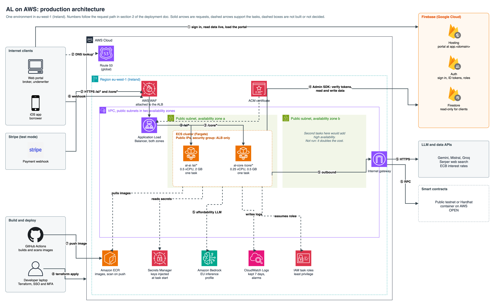
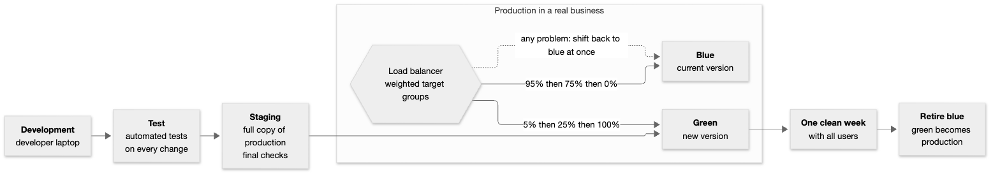

# AL Deployment

| | |
|---|---|
| Scope | Where AL runs when deployed, how the team builds and releases it, and the reason for each choice |
| Version | 1.0 |
| Date | October 2026 |
| Owner | Nic |
| Status | Design. Nothing has been deployed yet. Items marked Open need a team decision |

## 1. Overview

AL will have one deployed environment, production, as well as a local setup on each developer's laptop. Firebase Hosting will serve the web portal. The two Python services (al-ai and al-core) will run in containers on AWS. Firebase will continue to handle data and login. Terraform will define the AWS resources, which the team can create before the demo and remove afterwards.

| Piece | Where it runs | Status |
|---|---|---|
| Web portal | Firebase Hosting at `app.<domain>` | Planned |
| al-ai and al-core | AWS ECS Fargate (ARM64) in eu-west-1, one task each | Planned |
| Front door | Route 53 resolves `api.<domain>` to one Application Load Balancer, which has a WAF attached | Planned |
| Container images | Amazon ECR, ARM64 images built only by GitHub Actions (section 6) | Planned |
| Secrets | AWS Secrets Manager | Planned |
| Logs | CloudWatch Logs, kept 7 days | Planned |
| Affordability LLM | Qwen3 32B on Amazon Bedrock on the live site in place of Ollama. Qwen3.5 9B on Ollama locally (`qwen3.5:9b`), from the same Qwen family | Decided |
| Data and login | Firebase: Firestore and Auth | Decided (the hosted project is its own ticket) |
| Smart contracts | A public testnet. Dumi picks Polygon Amoy or Arbitrum Sepolia | Decided (network open) |
| iOS app | The App Store through Ibrahima's paid Apple Developer account, bought at the end of October 2026. The Simulator is the backup | Decided |
| Stripe | Test mode. Its webhook calls the load balancer | Later |
| Infrastructure | Terraform in a `deploy/` folder | Planned |

The domain is `agentic-lender.com`, registered through Route 53 on 6 October 2026 (the registration was still in progress when this was written). The addresses are `app.agentic-lender.com` and `api.agentic-lender.com`.

The domain is registered in Nic's account, but the deployment will run in Nikoloz's account. The plan is to create the DNS zone in Nikoloz's account and point the domain's name servers at it, so Terraform can manage every record. This is not done yet.

## 2. Architecture

*Figure 1. AWS architecture. The numbers match the steps below. Solid arrows are requests; dashed arrows support the tasks. In the public-subnet setup, calls from the tasks to ECR, Secrets Manager, Bedrock and CloudWatch leave through the internet gateway; the diagram draws them directly for clarity. The diagram leaves out container ports. Placing both tasks in zone a is illustrative, because ECS may start a task in either zone. Edit the diagram in draw.io: `diagrams/09-aws-architecture.drawio`.*

A request follows these steps:
1. A user visits the portal on Firebase Hosting. The portal and iOS app use Firebase Auth to sign in and connect straight to Firestore to read data.
2. Each write goes to `api.<domain>` as an API request. Route 53 resolves the name to the load balancer. The WAF is attached to the load balancer and filters floods before requests reach the tasks.
3. The load balancer routes `/ai/*` requests to al-ai and `/core/*` requests to al-core. Only the load balancer can reach the task security group.
4. Both services validate the Firebase token and use the Admin SDK to write to Firestore. They get their keys from Secrets Manager, which ECS supplies when a task starts.
5. For the affordability agent, al-ai calls Bedrock. It also reaches Gemini, Mistral, Groq, Serper and the ECB over the internet. Al-core calls the ledger. Both tasks use public subnets and public IPs, so they can make these outbound calls without a NAT gateway.
6. Stripe sends its webhook through the same load balancer to al-core.
7. GitHub Actions builds the ARM64 images for a release and uploads them to ECR.
8. A person starts the deploy. Terraform then updates both ECS services to use the new image.

## 3. Environments

**AL has one environment: production.** Developers work on their laptops with the Firebase emulators, a local Hardhat node, Ollama and a local gateway. A second AWS environment for staging would double the cost. The deployment will run in Nikoloz's AWS account, which Nic sets up and manages. Nic's own account has no credits left, so check what credits Nikoloz's account has before assuming anything is free. The plan is a test run in Sprint 3 (16 to 29 November): deploy, check everything works, then tear it down. The deployment comes back up for demo week, before the demo on 4 January 2027. The test run plus demo week costs about EUR 40.

A typical production setup uses several environments and moves each change between them:

| Environment | Used for | Common pattern | In AL |
|---|---|---|---|
| Development | Building and trying things | Each developer, often their own cloud sandbox | Each laptop |
| Test | Automated tests on every change | A shared test environment | GitHub Actions on every PR |
| Staging | A full copy of production for final checks | A separate AWS account | Not built (cost) |
| Production | Real users | Its own AWS account with approvals | One AWS deployment |

*Figure 2. A common way to release a change.*

This release process is deliberately slow. First, the new version runs in staging. Then a second production copy, called green, starts alongside the current blue copy. The load balancer sends a small portion of requests to green, perhaps 5%, then 25%, then 100%, while the team checks for errors at each stage. If a problem appears, resetting the weights returns traffic to blue straight away. Once green has handled all traffic without problems for about a week, the old copy is stopped and green becomes production.

AL's budget will not cover two full copies, so it will replace the running tasks in place and use health checks to catch a bad version. The Terraform can create a second copy by changing one name. Running both copies during demo week would roughly double that week's cost.

## 4. Options considered

| Decision | Options | Choice | Why |
|---|---|---|---|
| Run the containers | ECS Express Mode, plain ECS Fargate, App Runner, EC2, Lambda | Plain ECS Fargate | Express Mode does not expose the load balancer rules needed for one host. AWS no longer accepts new App Runner customers. EC2 would mean maintaining servers. Lambda would add cold starts to the ML service |
| CPU architecture | ARM64 (Graviton), x86 | ARM64 | Our Macs are ARM, so they build and run the same image that gets deployed without emulation. Fargate on ARM64 costs about 20% less. GitHub has free ARM runners for public repositories. Switching back to x86 is one setting in the task definitions and the build workflow |
| Load balancer | Application, Network, Gateway | Application | Only the Application Load Balancer can route by URL path, and AWS WAF can protect it. The Network option handles raw TCP, while the Gateway option is for security appliances |
| Hostnames | One host with path routing, or one URL per service | One host (`api.<domain>`) | This gives the team one base URL, one CORS entry, one WAF and one Stripe address. It requires a domain and a free certificate |
| Subnets | Public with tight security groups, or private with a NAT gateway | Public in the Sprint 3 test run, private in the demo week if the budget allows | Tasks in private subnets have no public address. A NAT gateway costs about EUR 30 a month |
| Secrets | Parameter Store, Secrets Manager | Secrets Manager | It costs about EUR 3 a month for eight secrets, with rotation available if needed |
| Infrastructure | Console clicks, shell scripts, OpenTofu, Terraform | Terraform | It is widely used, has a large community and the team already knows the commands. The plan uses one flat folder and four wrapper commands. State will sit in an encrypted, versioned and locked S3 bucket |
| Deploys | Fully automatic, or started by a person | Started by a person | Images are built after a merge. A button or one command starts the deploy and helps prevent accidental releases |
| Valuation model | Inside al-ai, its own container, SageMaker, Lambda | Inside al-ai | The model loads at start-up and should respond in milliseconds. Testing will measure this. The other options add cost and a network hop |
| Affordability model | Claude Haiku 4.5, Claude Sonnet 4.6, gpt-oss-120b, Qwen3 32B, Mistral and others usable from eu-west-1 | Qwen3 32B | Bedrock replaces Ollama on AWS, so the team picked a model from the same Qwen family as the local `qwen3.5:9b`. Local runs and the live site then behave alike. Decided at the team meeting on 8 Oct 2026 |
| Smart contracts | Public testnet, or a Hardhat container on AWS | Public testnet | It is free, keeps its state and anyone can check a loan note on the block explorer. A Hardhat container costs money and loses everything when it restarts. Only the loan note and the audit hash go on-chain, never personal data. Decided on 8 Oct 2026; Dumi picks the network |

## 5. Well-Architected review

AWS groups good cloud design into six pillars. This table records AL's plans for each pillar and the parts left out on purpose.

| Pillar | What AL plans | What it leaves out, and why |
|---|---|---|
| **Operational excellence** | Terraform will define all AWS resources. Four wrapper commands handle up, deploy, status and down. Both services have health checks. CloudWatch logs include a request id on every call. Alarms cover unhealthy tasks, load balancer 5xx errors and the budget. GitHub Actions builds the images | No distributed tracing, automatic test gate before a deploy or on-call rota. Those go beyond a student prototype |
| **Security** | HTTPS only, using a free AWS certificate. The WAF has a rate limit. The task security group accepts traffic only from the load balancer. Secrets stay in Secrets Manager. Each task role gets only the access it needs, such as one Bedrock model. Every call checks its Firebase token. Client Firestore rules allow reads only; each service's IAM role and endpoint checks limit its Firestore access. People use SSO and MFA to sign in. GitHub deploys with a short-lived role that trusts this repository only. Every commit gets a secret scan | GuardDuty and Security Hub are excluded because they add cost. During the Sprint 3 test run, tasks have public IPs and unrestricted outbound access, which is broader than private subnets. If the budget allows, private subnets with a NAT gateway will close that gap in demo week |
| **Reliability** | The load balancer uses two availability zones and checks task health. ECS replaces a task if it stops or fails a health check. The services store no state; Firebase holds the data. Recovery means rebuilding with Terraform. The team will time that rebuild before the demo | Each service has one task in one zone, so a zone failure or task replacement causes downtime. A second task in each zone would double compute costs. There is no blue/green release (section 3) |
| **Performance efficiency** | The ML model stays loaded in memory. Tasks start small (al-ai 0.5 vCPU and 2 GB, al-core 0.25 vCPU and 0.5 GB), then are resized after memory and load are measured. Firebase Hosting serves the portal through a CDN. Region eu-west-1 is close to Cork | There is no autoscaling, since only a handful of users are expected at the demo |
| **Cost optimization** | The services share one load balancer. Task counts stay fixed. There is no NAT gateway in the test run. Logs are kept 7 days, and budget alerts are enabled. Hourly resources are removed after the demo. Firebase stays on its free tier | Reserved capacity and savings plans do not fit a deployment that runs for days |
| **Sustainability** | Tasks have small fixed sizes. The deployment uses one region and is removed after the demo | There are no separate measurements. Turning off unneeded resources is the main saving |

## 6. How a deploy runs

The commands below are planned; the Terraform and wrapper scripts still need to be written.

**Two kinds of image.** Each developer builds images on their own laptop to test the product, with `docker compose`. Docker builds them for that laptop's CPU (ARM on a Mac, x86 on most Windows PCs) and they never leave the laptop. Only GitHub Actions builds the images that are deployed, always for ARM64, for both al-ai and al-core. Nobody pushes images to ECR by hand. If CI is broken, Nic's Mac builds ARM64 natively and pushes as a backup.

**One-time setup.** Set up the Terraform state bucket, a GitHub deploy role that trusts only this repository and the `main` branch, and set up the DNS zone for the domain (the one Route 53 created at registration, or a new one in Nikoloz's account as described in section 1). Terraform will add the DNS records used to validate the certificate to that zone. Route 53 will point `api.<domain>` to the load balancer. Solomon hands al-core's keys (wallet key, RPC URL, contract addresses) to Nic in person or through a one-time secret link, never in Slack or Jira, and Nic stores them in Secrets Manager.

1. **Build.** On every PR, GitHub Actions builds both images for ARM64 without pushing them, so a Dockerfile that will not build on ARM fails before merge. When the change is merged to `main`, GitHub Actions builds both images again and pushes them to ECR, tagged with the commit id. ECR runs a basic scan each time an image is pushed. It reports findings but does not stop a deploy.
2. **Deploy.** A person signs in with `aws sso login` and runs `deploy <tag>`. The GitHub Actions deploy button does the same work using the GitHub role instead of a person's login. Terraform changes both ECS services to the new image.
3. **Verify.** ECS starts the new tasks. The load balancer waits for their health checks to pass before sending them traffic, then the old tasks stop. `status` shows the service addresses and health. Tasks read secrets when they start, so changing a secret requires another deploy.
4. **Tear down.** At the end of the Sprint 3 test run and again after the demo, `down` removes the resources billed by the hour: the tasks, load balancer, WAF and public IP addresses. The domain, DNS zone (including its certificate validation record), secrets, image registry and state bucket remain. They cost about EUR 5 a month, and keeping them avoids setting up the certificate and keys again.

Each command explains in plain words what it will change and asks before proceeding. The `down` command asks twice.

## 7. Cost and guardrails

Estimated monthly costs if the full setup runs all month. These estimates use published eu-west-1 list prices, converted to euro, before VAT, with low traffic and low log volume. Check them in the AWS Pricing Calculator.

| Item | About |
|---|---|
| al-ai task (0.5 vCPU, 2 GB, ARM64) | EUR 17 |
| al-core task (0.25 vCPU, 0.5 GB, ARM64) | EUR 7 |
| Application Load Balancer | EUR 18 |
| WAF with a few rules | EUR 7 |
| Public IPv4 addresses (two for the load balancer, one per task) | EUR 13 |
| Secrets Manager (8 secrets) | EUR 3 |
| Domain, DNS zone, logs, registry | EUR 3 |
| **Total with public subnets** | **about EUR 68** |
| Private subnets in the demo week | about EUR 9 a week for the NAT gateway plus data charges, and about EUR 3 a week less for the task IP addresses |
| Bedrock calls | pennies at this volume |

Nic's own AWS account has no active credits, because its sign-up credits expired on 14 September 2026. The deployment will run in Nikoloz's account instead. Before the first deploy, check that account's credits and payment method in its Billing console. Nic covers any charges the credits do not. Budgets send alerts but do not limit spending. Guardrails:
- Set two budget alerts on actual charges, one at about EUR 20 and one at about EUR 50.
- Use the AWS account spend limit if this account can access it (paid plan only, limited release).
- Keep task counts fixed with no autoscaling, and set a WAF rate limit on the load balancer.
- Set a spend cap in each LLM provider dashboard that offers one.
- Remove the deployment after the demo.

The WAF allows about 300 requests per source IP in a rolling five-minute window, although AWS applies the limit approximately. Stripe uses a few webhook source addresses. If the limit blocks those requests, add an exception only for `/core/webhooks/stripe`, since Stripe's signature check already protects that route.

## 8. Open decisions

| Decision | Options | Owner and when |
|---|---|---|
| Which public testnet | Polygon Amoy or Arbitrum Sepolia | Dumi |
| AWS account and who pays | Nic's own account with budget caps, Nikoloz's account with Nic as admin, or another cloud (Azure for Students, GCP) | Decided: Nikoloz's account, which Nic sets up and manages with admin access. Nic covers any charges the account's credits do not, and sets the budget alerts. The supervisor has also been asked about AWS Academy and course credits |
| Stripe test payments | Webhook through the load balancer, tested locally with the Stripe CLI | Nic makes the Stripe sandbox account. Sprint 3 |
| Task sizes | Start small, then measure | Nic, during the Sprint 3 test run |
| Domain | `agentic-lender.com` is registered at Route 53. The registrant email must be verified | Nic, within 15 days of registering |

## 9. Issues met

Problems found while writing this design, and how each was resolved.

| Issue | What happened | Resolution |
|---|---|---|
| The AWS credits had expired | The plan assumed $100 of credits. The Billing console showed no active credits: the three sign-up credits expired on 14 September 2026. | Nikoloz offered their AWS account and Nic will set it up and manage it. The plan still treats every charge as real money until that account's credits are checked, about EUR 40 for the Sprint 3 test run and demo week. Budget alerts and teardown are the guardrails (section 7). The account question is in section 8 |
| AWS Academy would not fit | The Learner Lab is limited to us-east-1 and us-west-2, allows a restricted set of services and stops after about 4 hours. AWS Educate and Student Rewards offer about $30. These details come from secondary sources and are not confirmed | Not used for now. The supervisor has been asked whether the college has Academy access |
| The first cost estimate was too low | It missed the charge for public IPv4 addresses, so EUR 58 became about EUR 74 a month | Corrected after a review, and the table in section 7 now lists the addresses |
| Who builds images, and for which CPU | The team mixes ARM Macs and x86 Windows laptops, so it was unclear whether images would need emulation and whose laptop would build the deployed ones | Deploy images are built only by GitHub Actions, for ARM64. Laptops build their own native images for local testing only. The ARM64 build also runs on every PR, so an x86-only problem shows up before merge (section 6) |
| The first diagram showed the wrong request path | It drew Route 53, then the WAF, then the load balancer as one chain, and put the WAF inside the VPC | Route 53 now appears as a DNS lookup. The WAF is attached to the load balancer and sits in the Region, outside the VPC |
